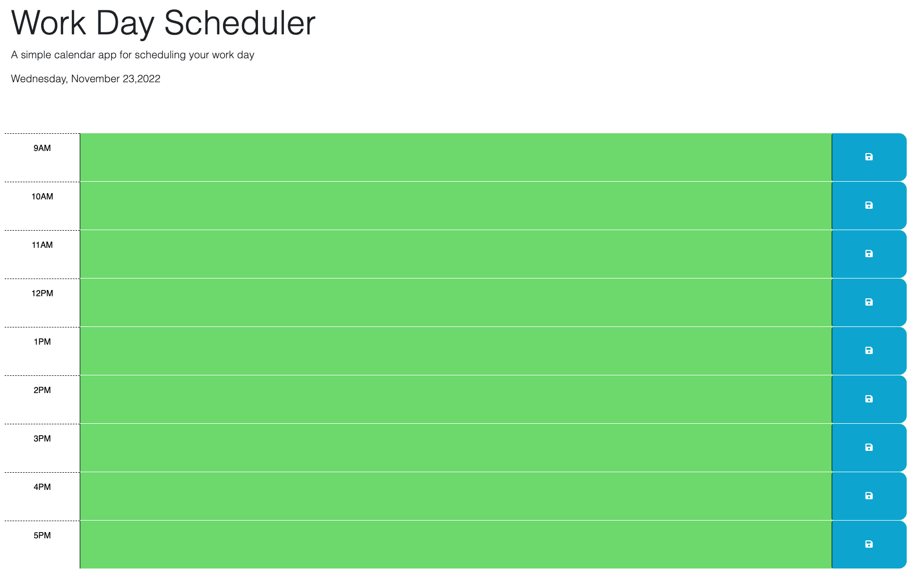
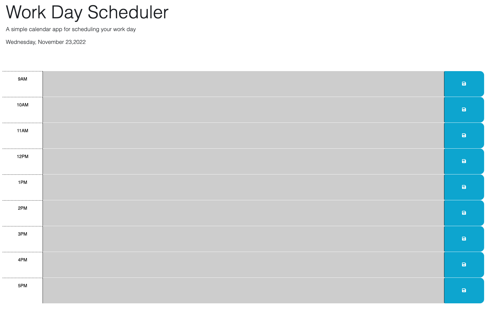
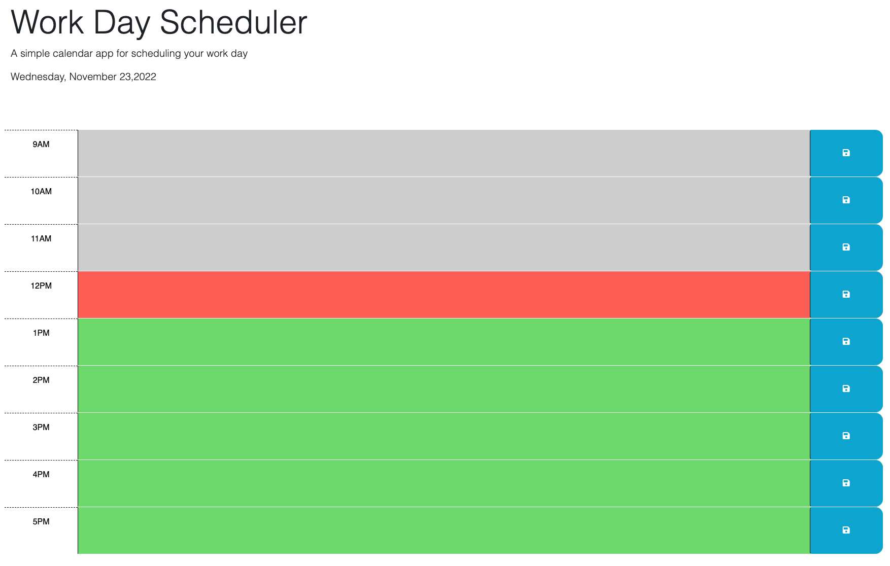
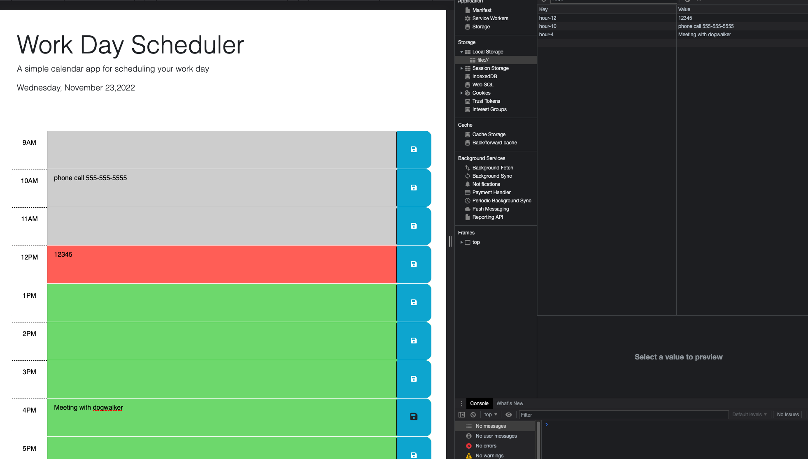

Daily Planner web app

In this web app, users can fill out their daily tasks and reminders for work. The work hours are set from 9am to 5pm and the color will match with teh current days time. If you're working after hours the colors will match to what time it is in the future or the past. Upon entering the information the data get stored in the local storage os a page refresh will not cause the page to wipe the information.

GIVEN I am using a daily planner to create a schedule

WHEN I open the planner
THEN the current day is displayed at the top of the calendar

WHEN I scroll down
THEN I am presented with timeblocks for standard business hours

WHEN I view the timeblocks for that day
THEN each timeblock is color coded to indicate whether it is in the past, present, or future

WHEN I click into a timeblock
THEN I can enter an event

WHEN I click the save button for that timeblock
THEN the text for that event is saved in local storage

WHEN I refresh the page
THEN the saved events persist

